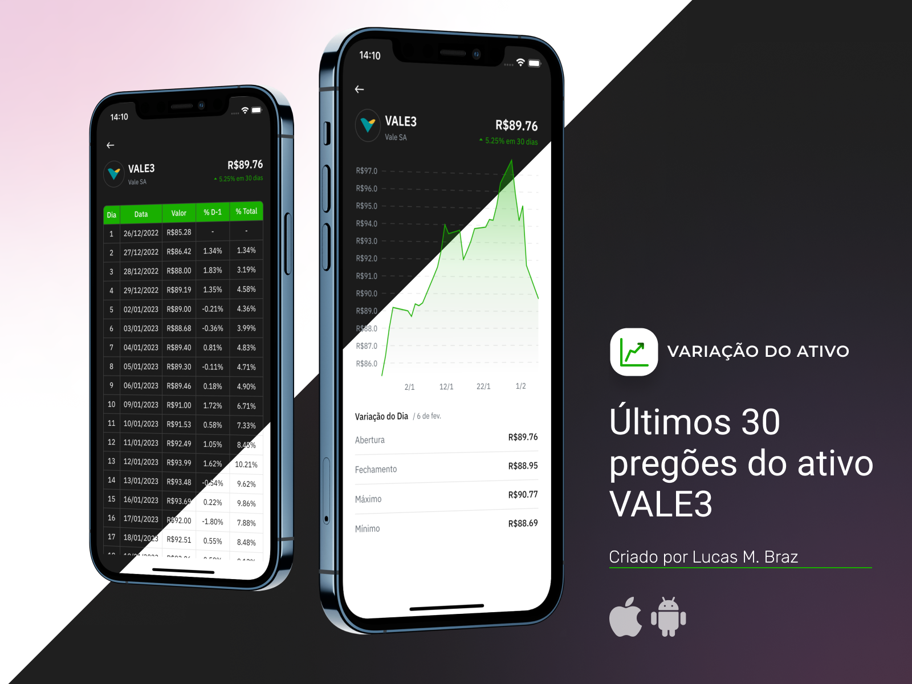
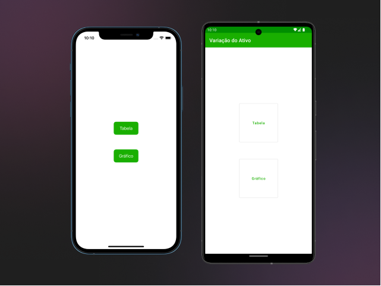
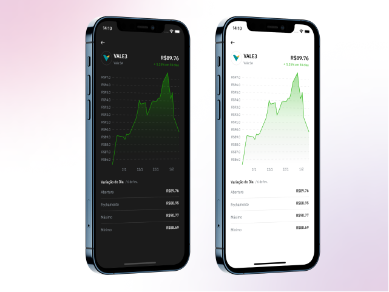

## Introdução

O aplicativo *"Variação do Ativo"* apresenta os dados dos últimos 30 pregões do ativo VALE3. Os dados podem ser visualisados de duas maneiras: 
- Tabela: exibe o valor de abertura de cada dia além da variação porcentual com relação ao dia anterior e ao primeiro dia da lista;
- Gráfico: mostra os valores de abertura de cada pregão em um gráfico de linha. Traz também os valores de fechamento, máximo e mínimo do útimo pregão. 

## Plataformas Suportadas

O aplicativo está disponível nas plataformas *Android* e *iOS*. As funcionalidades foram desenvolvidas em *Flutter* e, portanto, o código é compartilhado entre as duas plataformas. 

Existe, porém, uma tela que permite ao usuário escolher a forma de visualição dos dados. Esta tela, mostrada abaixo, foi desenvolvida de forma nativa.



#### Organização do Projeto

O projeto está dividido em três partes, conforme demonstrado a seguir:

```
/project/root
└── android_stockpricechange/         <--- Aplicativo Android
└── flutter_module_stockpricechange   <--- Módulo em Flutter (código compartilhado)
└── ios_stockpricechange              <--- Aplicativo iOS
```

## Execução Local

Para executar o projeto localmente, é necessário ter o *Flutter* configurado na máquina (para *iOS*, também é necessário ter *cocoapods* ) e abrir cada um dos aplicativos na IDE correspondente. 

O script abaixo exemplifica este processo.

```bash
  #!/bin/bash
  cd flutter_module_stockpricechange/
  flutter pub get

  # For Android builds:
  open -a "Android Studio" ../android_stockpricechange # macOS only
  # Or open the ../android_stockpricechange folder in Android Studio for other platforms.

  # For iOS builds:
  cd ../ios_stockpricechange
  pod install
  open stockpricechange.xcworkspace
```

### Comunicação Flutter <> Nativo

A comunicação entre a plataforma nativa e o Flutter foi implementada com o auxílio do [pigeon](https://pub.dev/packages/pigeon). 

Quando o usuário escolhe uma das opções na tela nativa (tabela ou gráfico), a plataforma nativa envia uma mensagem para o Flutter antes de iniciar a tela do Flutter. 

Já na tela Flutter, quando o usuário utiliza o botão para voltar a tela anterior, o Flutter envia uma mensagem a plataforma nativa, que é então responsável por realizar a navegação. 

## Arquitetura

A arquitera do módulo Flutter segue o padrão [Redux](https://pub.dev/packages/flutter_redux). Todos os dados apresentados pela UI vêm da *store* do Redux. 

Existe um *middleware* (`RepositoryMiddleware`) que é responsável por fazer a comunicação assíncrona com o repositório para recuperar os dados. 

O padrão de projeto *Repository*(`TradingDaysRepository`) foi utilizado para abstrair da aplicação a fonte dos dados. Com ele, seria possível substituir a API utilizada sem afetar o resto da aplicação. Também seria possível utilizar um *cache* em disco ou memória, também sem impactar a aplicação. 

Por fim, a comunicação com a API do Yahoo Finance foi feita utilizando o [Dio](https://pub.dev/packages/dio) e está implementada em um *package* separado (`packages/yahoo_finance_api`) que poderia, por exemplo, ser compartilhado com outros projetos. 

## Design System

A UI do applicativo utiliza o conceito de design system, que foi implementado em um *package* separado, chamado `sp_design_system` (assim como a consumo da API, este poderia ser compartilhado com outros projetos).

Um dos benefícios deste design system é o suporte ao dark mode, como visto abaixo, que é conseguido pelo uso consistente da classe `SpColors`.



## Testes Automatizados

Existem dois exemplos de testes automatizados no projeto: testes unitário para o *reducer*, checam as regras de negócio do aplicativo; testes de widget para o `StockInfo` demonstra como verificar que a UI do *Flutter* apresenta os dados desejados. 

Idealmente, o projeto teria muitos mais testes destes tipos, além de alguns testes de integração. Por restrição de tempo, não foram implementados mais testes, porém estes servem de exemplo da direção que o projeto deveria tomar.

## Demo

